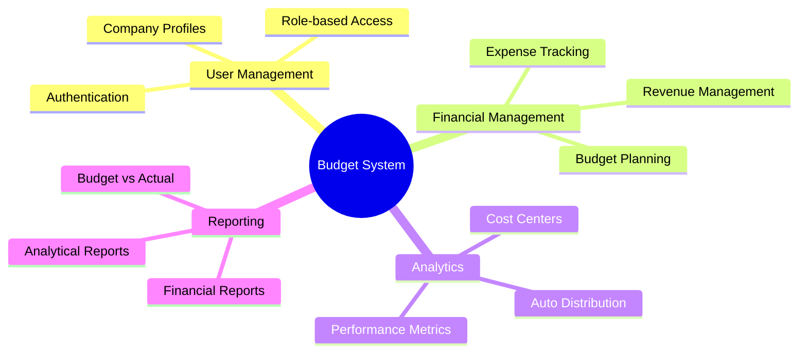
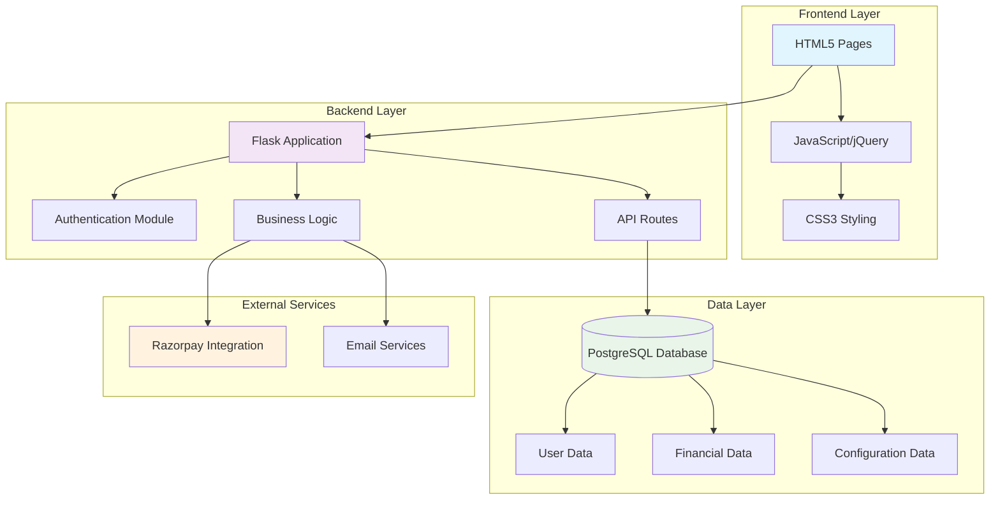
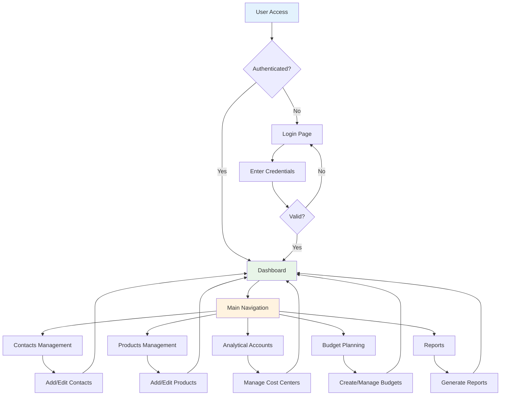
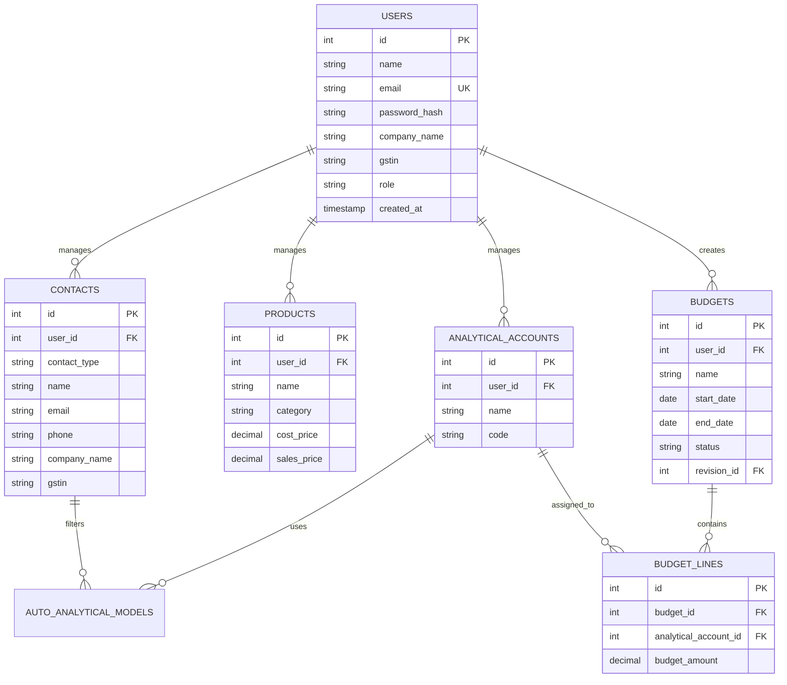

# 💰 Budget Accounting System

<div align="center">


**A comprehensive budget management and accounting system built for modern businesses**

[🚀 Quick Start](#-quick-start) • [📖 Documentation](#-documentation) • [🏗️ Architecture](#️-system-architecture) • [🎯 Features](#-features)

</div>

---

## 📋 Table of Contents

- [🎯 Project Overview](#-project-overview)
- [✨ Key Features](#-key-features)
- [🏗️ System Architecture](#️-system-architecture)
- [🔄 User Flow](#-user-flow)
- [🛠️ Technology Stack](#️-technology-stack)
- [🚀 Quick Start](#-quick-start)
- [📁 Project Structure](#-project-structure)
- [🔧 Configuration](#-configuration)
- [📊 Database Schema](#-database-schema)
- [🎨 UI Screenshots](#-ui-screenshots)
- [🧪 Testing](#-testing)
- [🚀 Deployment](#-deployment)
- [👥 Contributing](#-contributing)
- [📄 License](#-license)

---

## 🎯 Project Overview

The **Budget Accounting System** is a comprehensive financial management solution designed for small to medium-sized businesses. Built with modern web technologies, it provides a complete suite of tools for budget planning, expense tracking, analytical accounting, and financial reporting.

### 🎪 **Company Focus: Shiv Furniture**
This system is specifically tailored for **Shiv Furniture**, providing industry-specific features for furniture manufacturing and retail operations.

### 🎯 **Problem Statement**
Traditional accounting systems are often complex, expensive, and lack the flexibility needed for modern businesses. Our solution addresses:
- ❌ Complex budget planning processes
- ❌ Lack of real-time financial insights
- ❌ Poor integration between different financial modules
- ❌ Limited analytical accounting capabilities

### 💡 **Our Solution**
A unified, web-based platform that combines:
- ✅ Intuitive budget management
- ✅ Real-time financial dashboards
- ✅ Automated analytical account distribution
- ✅ Comprehensive reporting system

---

## ✨ Key Features

<div align="center">



</div>

### 🔐 **Authentication & Security**
- JWT-based authentication
- Role-based access control (Admin/Portal User)
- Secure password hashing with bcrypt
- Session management

### 💼 **Contact Management**
- Customer and vendor profiles
- GST information management
- Contact categorization
- Communication tracking

### 📦 **Product Management**
- Product catalog with categories
- Cost and sales price tracking
- Inventory integration ready
- Product performance analytics

### 📊 **Analytical Accounting**
- Cost center management
- Automatic account distribution
- Rule-based allocation
- Multi-dimensional analysis

### 💰 **Budget Management**
- Multi-period budget planning
- Budget revisions and versions
- Approval workflows
- Budget vs actual analysis

### 📈 **Reporting & Analytics**
- General Ledger reports
- Trial Balance
- Analytical account reports
- Real-time dashboards

---

## 🏗️ System Architecture

<div align="center">



</div>

### 🔧 **Architecture Components**

#### **Frontend Architecture**
- **Presentation Layer**: HTML5 with responsive design
- **Interaction Layer**: Vanilla JavaScript with jQuery
- **Styling Layer**: Custom CSS3 with modern design principles
- **Communication**: RESTful API calls with JSON data exchange

#### **Backend Architecture**
- **Web Framework**: Flask 3.0.0 with Blueprint organization
- **Authentication**: JWT tokens with role-based access
- **Database ORM**: Raw SQL with psycopg2 for optimal performance
- **API Design**: RESTful endpoints with consistent response format

#### **Database Architecture**
- **RDBMS**: PostgreSQL 18.1 for ACID compliance
- **Connection Pooling**: Efficient connection management
- **Schema Design**: Normalized structure with referential integrity
- **Indexing**: Optimized queries with strategic indexes

---

## 🔄 User Flow

<div align="center">



</div>

### 👤 **User Journey**

1. **🔐 Authentication Flow**
   - User accesses the system
   - Login with email/password
   - JWT token generation
   - Role-based dashboard access

2. **📊 Dashboard Experience**
   - Real-time financial metrics
   - Quick action buttons
   - Recent activity feed
   - Navigation to modules

3. **💼 Business Operations**
   - Manage contacts (customers/vendors)
   - Maintain product catalog
   - Set up analytical accounts
   - Create and manage budgets

4. **📈 Reporting & Analysis**
   - Generate financial reports
   - Analyze budget performance
   - Export data for external use
   - Real-time dashboard updates

---

## 🛠️ Technology Stack

<div align="center">

| Layer | Technology | Version | Purpose |
|-------|------------|---------|---------|
| **Frontend** | HTML5 | - | Structure & Content |
| | CSS3 | - | Styling & Layout |
| | JavaScript | ES6+ | Client-side Logic |
| | jQuery | 3.x | DOM Manipulation |
| **Backend** | Python | 3.8+ | Server-side Language |
| | Flask | 3.0.0 | Web Framework |
| | Flask-CORS | 4.0.0 | Cross-Origin Support |
| | psycopg2 | 2.9.9 | PostgreSQL Driver |
| | bcrypt | 4.1.2 | Password Hashing |
| | PyJWT | 2.8.0 | JWT Authentication |
| **Database** | PostgreSQL | 18.1 | Primary Database |
| **External** | Razorpay | 1.4.1 | Payment Processing |

</div>

### 🎨 **Design Principles**
- **Responsive Design**: Mobile-first approach
- **User Experience**: Intuitive navigation and workflows
- **Performance**: Optimized queries and caching
- **Security**: Industry-standard security practices
- **Scalability**: Modular architecture for growth

---

## 🚀 Quick Start

### 📋 **Prerequisites**
- Python 3.8 or higher
- PostgreSQL 12 or higher
- Git

### ⚡ **Installation Steps**

1. **Clone the Repository**
   ```bash
   git clone https://github.com/yourusername/budget-accounting-system.git
   cd budget-accounting-system
   ```

2. **Set Up Virtual Environment**
   ```bash
   python -m venv venv
   source venv/bin/activate  # On Windows: venv\Scripts\activate
   ```

3. **Install Dependencies**
   ```bash
   cd backend
   pip install -r requirements.txt
   ```

4. **Configure Database**
   ```bash
   # Update config.py with your PostgreSQL credentials
   python setup_database.py
   ```

5. **Start the Application**
   ```bash
   python app.py
   ```

6. **Access the System**
   - Open your browser and navigate to `http://localhost:5000`
   - Login with default credentials:
     - **Email**: `admin@shivfurniture.com`
     - **Password**: `admin123`

---

## 📁 Project Structure

```
budget-accounting-system/
├── 📁 backend/
│   ├── 📁 routes/           # API route handlers
│   │   ├── auth.py          # Authentication routes
│   │   ├── contacts.py      # Contact management
│   │   ├── products.py      # Product management
│   │   ├── analytical_accounts.py
│   │   ├── budgets.py       # Budget management
│   │   └── stats.py         # Dashboard statistics
│   ├── 📁 utils/            # Utility modules
│   │   ├── auth.py          # Authentication helpers
│   │   └── db.py            # Database utilities
│   ├── 📁 migrations/       # Database migrations
│   ├── app.py               # Main Flask application
│   ├── config.py            # Configuration settings
│   ├── schema.sql           # Database schema
│   └── requirements.txt     # Python dependencies
├── 📁 frontend/
│   ├── 📁 css/              # Stylesheets
│   ├── 📁 js/               # JavaScript files
│   ├── login.html           # Login page
│   ├── dashboard.html       # Main dashboard
│   ├── contacts.html        # Contact management
│   ├── products.html        # Product management
│   ├── analytical-accounts.html
│   ├── budgets.html         # Budget management
│   └── reports.html         # Reporting interface
└── README.md                # Project documentation
```

---

## 🔧 Configuration

### 🗄️ **Database Configuration**
Update `backend/config.py`:
```python
class Config:
    DB_HOST = 'localhost'
    DB_PORT = '5432'
    DB_NAME = 'budget_system'
    DB_USER = 'postgres'
    DB_PASSWORD = 'your_password'
```

### 🔐 **Security Configuration**
```python
SECRET_KEY = 'your-secret-key-change-in-production'
JWT_SECRET_KEY = 'jwt-secret-key-change-in-production'
JWT_EXPIRATION_HOURS = 24
```

### 💳 **Payment Integration**
```python
RAZORPAY_KEY_ID = 'rzp_test_YOUR_KEY_ID'
RAZORPAY_KEY_SECRET = 'YOUR_KEY_SECRET'
```

---

## 📊 Database Schema

<div align="center">



</div>

### 📋 **Key Tables**

- **👥 Users**: System users with role-based access
- **📞 Contacts**: Customer and vendor information
- **📦 Products**: Product catalog with pricing
- **📊 Analytical Accounts**: Cost centers for budget tracking
- **💰 Budgets**: Budget headers with periods
- **📈 Budget Lines**: Detailed budget allocations
- **🤖 Auto Analytical Models**: Automatic account distribution rules

---

## 🎨 UI Screenshots

### 🔐 Login Interface
```
┌─────────────────────────────────────┐
│  🏢 Budget Accounting System        │
│                                     │
│  📧 Email: [________________]       │
│  🔒 Password: [________________]    │
│                                     │
│  [🚀 Login] [📝 Sign Up]           │
│                                     │
│  💼 Shiv Furniture Solutions        │
└─────────────────────────────────────┘
```

### 📊 Dashboard Overview
```
┌─────────────────────────────────────────────────────────┐
│ 🏠 Dashboard | 👥 Contacts | 📦 Products | 💰 Budgets  │
├─────────────────────────────────────────────────────────┤
│                                                         │
│  📈 Financial Overview                                  │
│  ┌─────────┐ ┌─────────┐ ┌─────────┐ ┌─────────┐      │
│  │ Total   │ │ Budget  │ │ Actual  │ │ Variance│      │
│  │ Revenue │ │ Amount  │ │ Spent   │ │ %       │      │
│  │ ₹50,000 │ │ ₹75,000 │ │ ₹45,000 │ │ +11%    │      │
│  └─────────┘ └─────────┘ └─────────┘ └─────────┘      │
│                                                         │
│  🎯 Quick Actions                                       │
│  [➕ New Budget] [👥 Add Contact] [📦 Add Product]     │
│                                                         │
└─────────────────────────────────────────────────────────┘
```

---

## 🧪 Testing

### 🔍 **Manual Testing**
1. **Authentication Testing**
   - Valid/invalid login attempts
   - JWT token validation
   - Role-based access control

2. **Functional Testing**
   - CRUD operations for all modules
   - Data validation and error handling
   - API endpoint testing

3. **Integration Testing**
   - Database connectivity
   - Frontend-backend communication
   - External service integration

### 🚀 **API Testing**
Use tools like Postman or curl to test API endpoints:

```bash
# Test authentication
curl -X POST http://localhost:5000/api/auth/login \
  -H "Content-Type: application/json" \
  -d '{"email":"admin@shivfurniture.com","password":"admin123"}'

# Test protected endpoint
curl -X GET http://localhost:5000/api/contacts \
  -H "Authorization: Bearer YOUR_JWT_TOKEN"
```

---

## 🚀 Deployment

### 🐳 **Docker Deployment** (Recommended)
```dockerfile
# Dockerfile
FROM python:3.9-slim
WORKDIR /app
COPY backend/requirements.txt .
RUN pip install -r requirements.txt
COPY . .
EXPOSE 5000
CMD ["python", "backend/app.py"]
```

### ☁️ **Cloud Deployment Options**
- **Heroku**: Easy deployment with PostgreSQL add-on
- **AWS**: EC2 + RDS for scalable solution
- **DigitalOcean**: App Platform for simple deployment
- **Google Cloud**: Cloud Run for containerized deployment

### 🔧 **Production Configuration**
```python
# Production settings
DEBUG = False
SECRET_KEY = os.environ.get('SECRET_KEY')
DB_PASSWORD = os.environ.get('DB_PASSWORD')
```

---

## 👥 Contributing

We welcome contributions! Please follow these steps:

1. **🍴 Fork the repository**
2. **🌿 Create a feature branch**: `git checkout -b feature/amazing-feature`
3. **💾 Commit changes**: `git commit -m 'Add amazing feature'`
4. **📤 Push to branch**: `git push origin feature/amazing-feature`
5. **🔄 Open a Pull Request**

### 📝 **Contribution Guidelines**
- Follow PEP 8 for Python code
- Add comments for complex logic
- Update documentation for new features
- Test your changes thoroughly

---

## 📞 Support & Contact

<div align="center">

**🏢 Shiv Furniture Solutions**

📧 **Email**: admin@shivfurniture.com  
🌐 **Website**: [www.shivfurniture.com](http://www.shivfurniture.com)  
📱 **Phone**: +91-XXXXX-XXXXX  

**Built with ❤️ for modern businesses**

</div>

---

## 📄 License

This project is licensed under the MIT License - see the [LICENSE](LICENSE) file for details.

---

<div align="center">

**⭐ Star this repository if you found it helpful!**

[](https://github.com/yourusername/budget-accounting-system/stargazers)
[](https://github.com/yourusername/budget-accounting-system/network)

</div>

---

*Last updated: February 2026*
